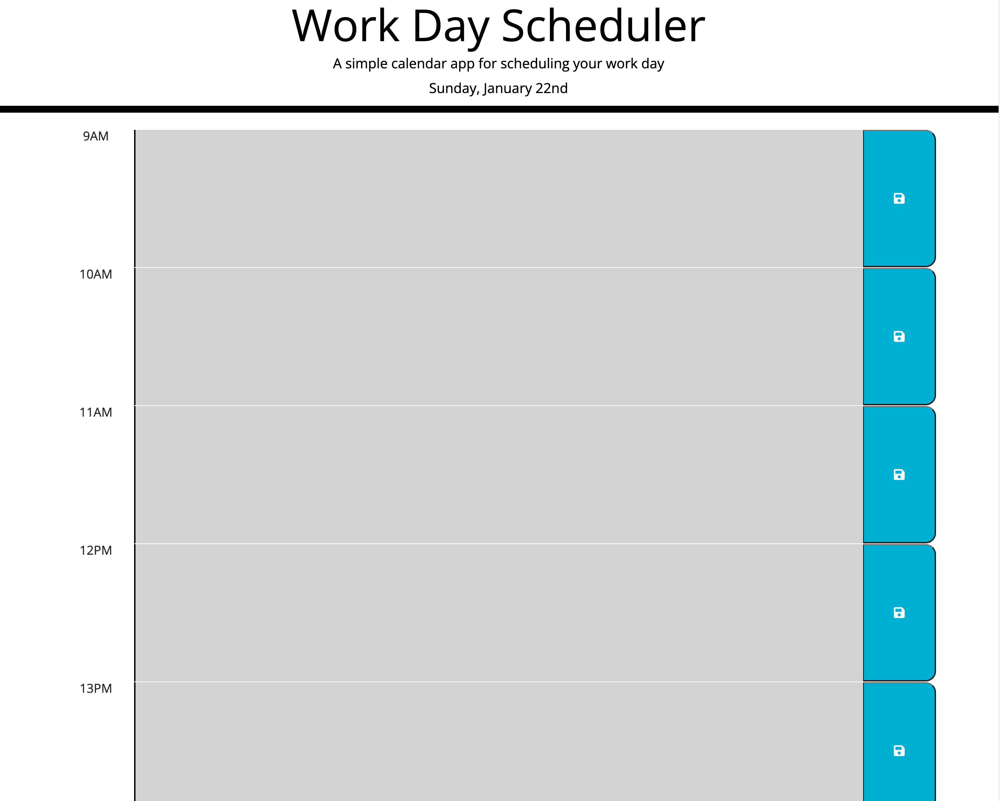

# Vinhs WorkDayScheduler

## What does it do?

It allows the user to save an event between the hours of 9AM to 17PM in local storage. The color of the events will change based upon the current time as followed:

In the past = grey, future = green and present = red.

### How did I create it?

- MomentJs to retrieve the current date and time
- For loop
- Local storage
- jQuery
- conditional statements
- DOM object
- functions
- Bootstrap

### Preview of the application

Here is a preview of the app

[Live preview here:](https://vinhkietla.github.io/Vinhs-WorkDayScheduler/)
